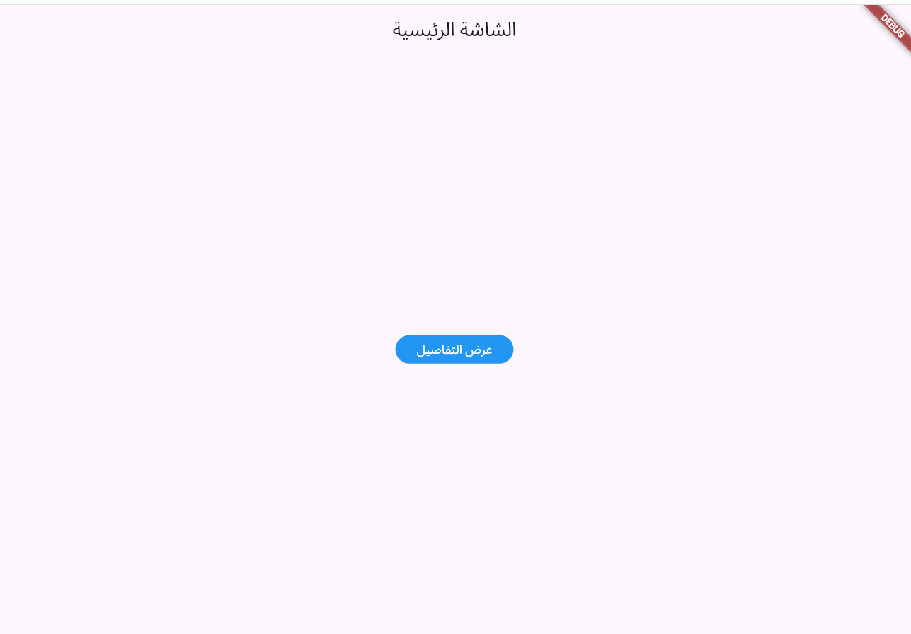
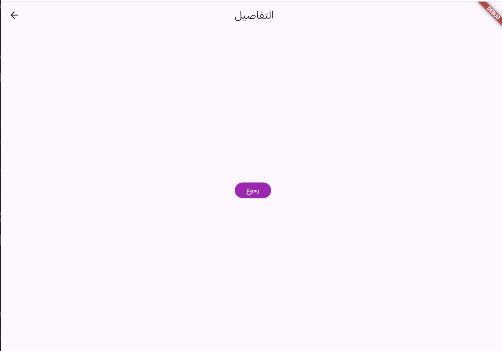

# مشروع Navigation
هذا المشروع هو تطبيق فلاتر يوضح مهارات التنقل بين الواجهات.

## لقطات من التطبيق (Screenshots)
| الواجهة الرئيسية | واجهة أخرى |
|---|---|
|  |  |

## مميزات المشروع
* واجهات مستخدم بسيطة وأنيقة.
* تنقل سلس بين الشاشات.